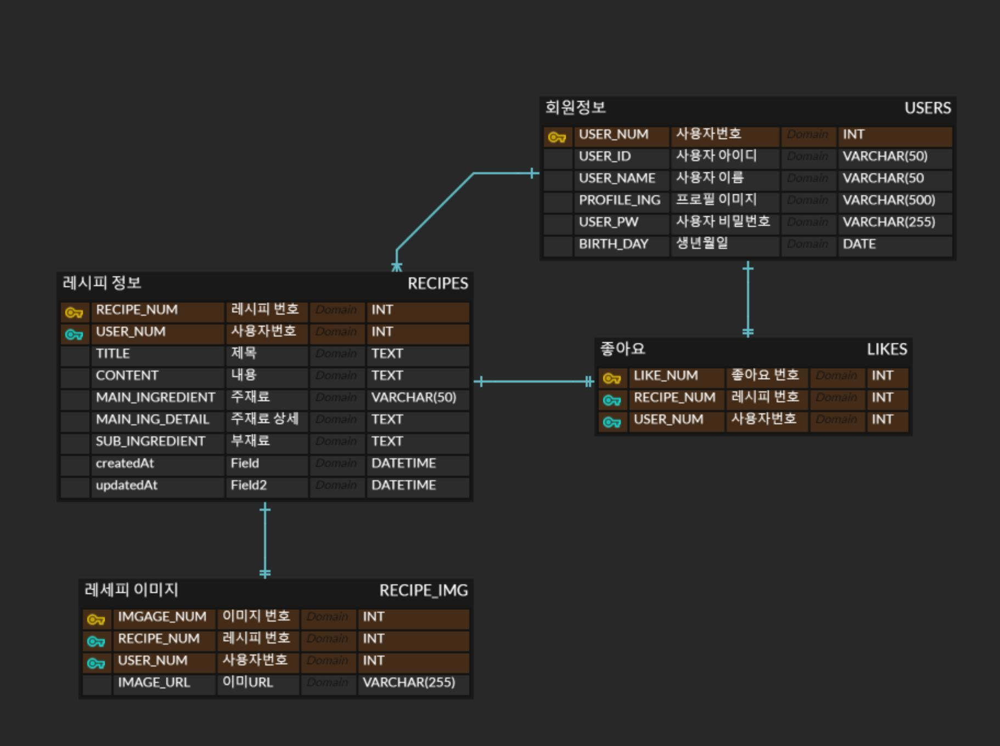
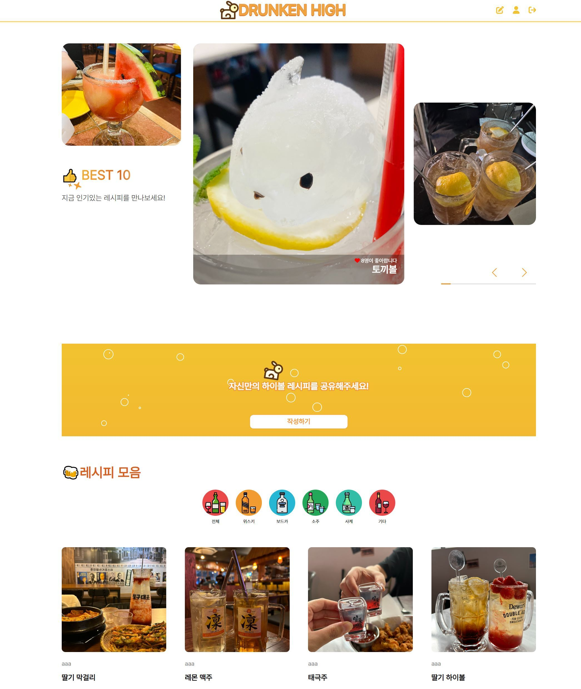
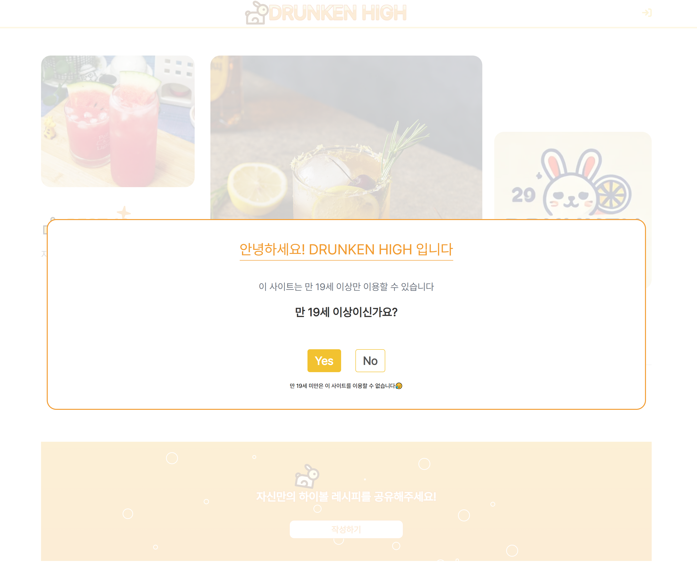
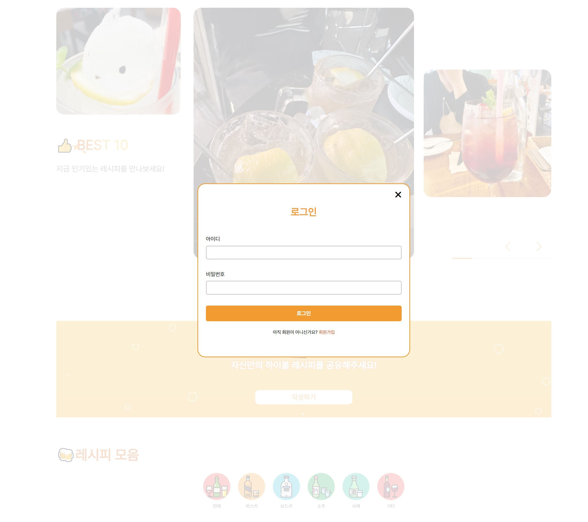
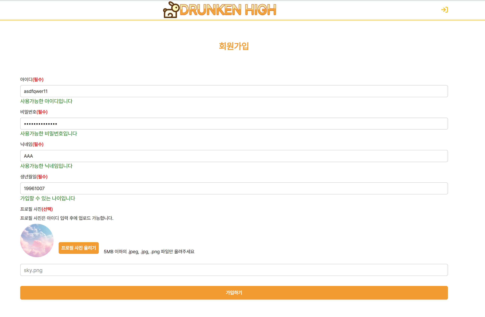
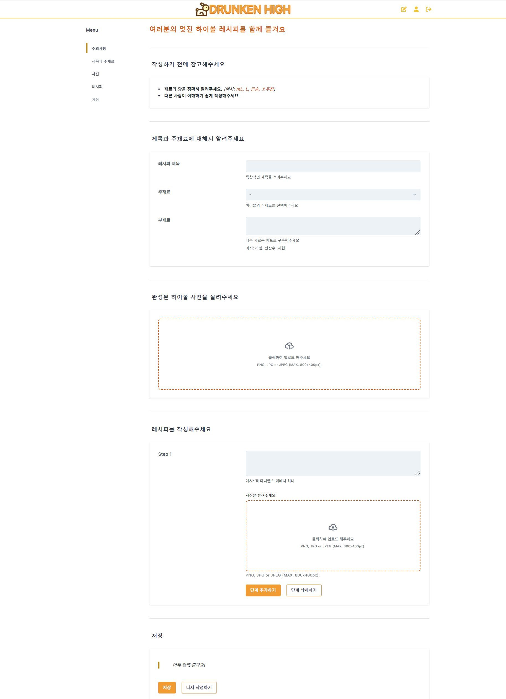
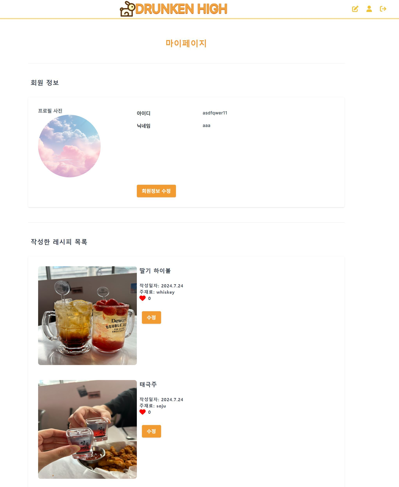

# drunkenHigh-SeSAC 1차 프로젝트
## drunkenHigh

* 나만 알고 있던 꿀주 만드는 레시피를 공유하고 소통하는 웹 사이트
* 기간 : 2024.07.05 ~ 2024.07.23
* 주제 : 유저들이 자신만의 하이볼 레시피를 작성해서 공유할 수 있는 플랫폼


* 개발툴: vscode, MySQLWorkbench
* 개발 환경 : nodejs
* 사용 언어 : MySQL, HTML, CSS, JavaScript, ejs, express
* 사용 기술 : jQuery, Axios, Tailwind, swiper


## Developers

|FE | BE |
| :---: | :---: |
|이다인|유예진|
|함태완|함태완|
|-|윤예슬|
|-|안다은|


## Tech

* Front-end: 
* Back-end: 
* DB: 
* Tools: 
* Deploy: 
* 협업 툴: 
* 디자인 패턴: MVC 패턴

## API 명세서 규칙
* 링크: 

## 기능별 Package
```
1. cookie : 쿠키
2. like : 좋아요
3. main : 메인페이지 (리스트)
4. recipes_image : 레시피 이미지 (multer)
5. recipes : 레시피 상세
6. users : 회원정보

````
## properties 분리

 1. .env
	공통 설정
	보안을 요구하는 공통 설정
 2. app.js
	개발시 필요한 설정
	DB연결등 보안을 요구하는 개별 설정

- 중요 정보는 .gitignore파일에 등록 됨
- github에 등록되지 않음에 유의

## 데이터베이스 ERD



## 주요 페이지

### 메인 


### 쿠키


### 로그인 


### 회원가입


### 레시피 작성 


### 내 정보


