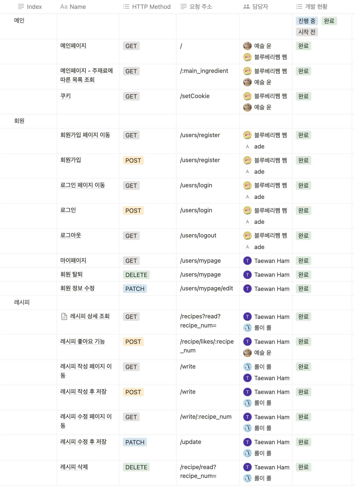
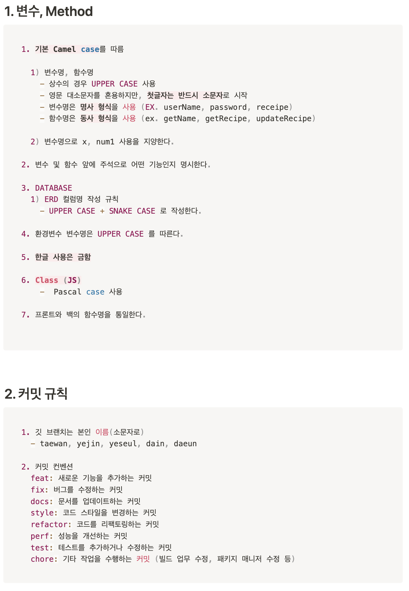

# :seedling: SeSAC 1차 프로젝트 drunkenHigh 
<br/>

## :tropical_drink: drunkenHigh


* 주제 : 유저들이 자신만의 하이볼 레시피를 작성해서 공유할 수 있는 플랫폼
* 기간 : 2024.07.05 ~ 2024.07.23
* 개발툴: vscode, MySQLWorkbench
* 개발 환경 : nodejs
* 사용 언어 : MySQL, HTML, CSS, JavaScript, ejs, express
* 사용 기술 : jQuery, Axios, Tailwind, swiper

<br>

## :raising_hand: Developers

|FE | BE |
| :---: | :---: |
|[이다인](https://github.com/DAIN302)|[유예진](https://github.com/yjyoo6831)|
|[함태완](https://github.com/wani-ham)|[함태완](https://github.com/wani-ham)|
|-|[윤예슬](https://github.com/errorose)|
|-|[안다은](https://github.com/AHNDAEUN)|

<br>

## :computer: Tech

* Front-end: 
              

* Back-end:
      

* DB: 

* Tools: 
   
* Deploy:       
* 협업 툴: 
   

<br>

## :bulb: API 명세서 및 개발규칙정의서
<details>
<summary>API 명세서<summary>
<div markdown="1">
    
</div>
</details>
<details>
<summary>개발규칙정의서<summary>
<div markdown="1">
    
</div>
</details>

<br>

## 📂 프로젝트 구조
<details>
<summary>프로젝트 구조<summary>
<div markdown="1">
    디자인 패턴 : MVC 패턴 
    
</div>
</details>

<br>

## :surfer: 기능별 Package
```
1. cookie : 쿠키
2. like : 좋아요
3. main : 메인페이지 (리스트)
4. recipes_image : 레시피 이미지 (multer)
5. recipes : 레시피 상세
6. users : 회원정보
````

<br>

## :pushpin: properties 분리

 1. .env
	공통 설정
	보안을 요구하는 공통 설정
 2. app.js
	개발시 필요한 설정
	DB연결등 보안을 요구하는 개별 설정

- 중요 정보는 .gitignore파일에 등록 됨
- github에 등록되지 않음에 유의

## 📚 데이터베이스 ERD


<br>

## :clipboard: 주요 페이지

### 메인 


### 쿠키


### 로그인 


### 회원가입


### 레시피 작성 


### 내 정보


